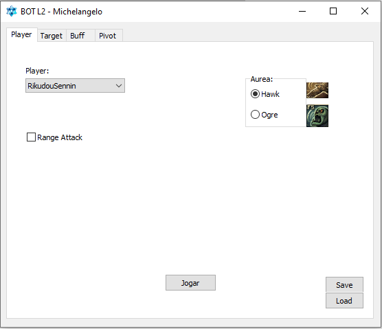
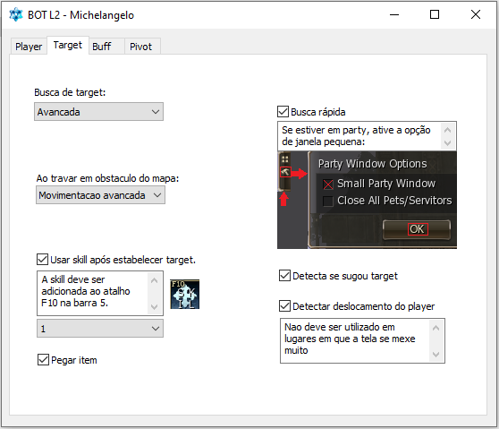

# Lineage 2 - Bot Experimental

## Detalhes

### Bot experimental desenvolvido para auxiliar a jogabilidade do Lineage 2.

Linguagem utilizada:
* Macro Scheduler 11

Versão do jogo compatível:
* Goddess of destruction+

Funcionalidades:
* Ataque automático
* Busca automática por target (simples e avançada)
* Uso automático de itens
* Uso automático de buffs
* Uso automático de aureas
* Coleta automática de drops
* Detecção de obstrução
* Seleção de perfis
* Auxilio automático com player secundário
* Retorno automático para pivot posicionado

---

## Imagens

    
    
    
    
    

